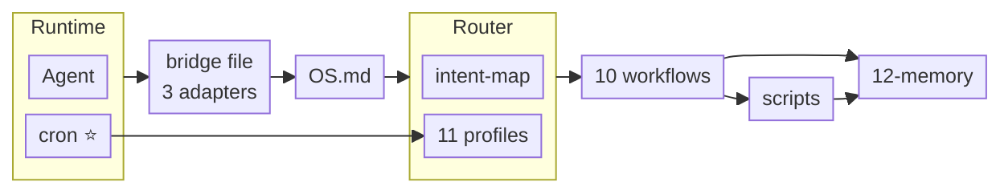
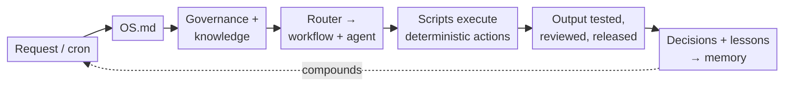
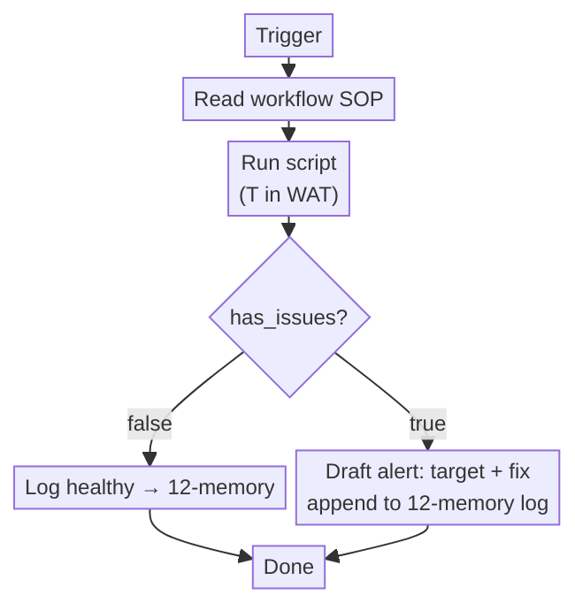
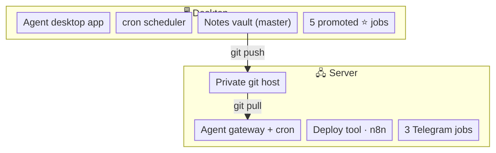

# AI OS — Flow Diagrams

> Call hierarchy and request flow for Clavex AI OS (WAT framework + an agent runtime).
> Rendered from: `OS.md`, `docs/ARCHITECTURE.md`, `03-engineering-os/**`, `07-scripts/`, `12-memory/`.

## Two machines on the LAN

The OS can span two machines on a private home network *(names anonymized)*:

- **Desktop** — the workstation PC running the **agent desktop app**. It is
  the vault's master writer and runs its own local cron scheduler.
- **Server** — an always-on LAN server running the **agent gateway + cron
  scheduler**, a **private git host** (for this repo and the vault), a
  **deployment tool**, and **n8n**. It keeps its own, separate cron scheduler.

Scheduled jobs run where their delivery requires them; vault sync flows
desktop → git host → server.

---

## 1. Call hierarchy — who invokes what

> ⭐ = **promoted**. Five agent-driven cron jobs (Email
> Intelligence, Daily Note Compile, Concept Sweep, Tool Matrix, Update Manager)
> no longer carry their procedure inline in the cron prompt.
>
> The cron now owns only the **schedule + gather script + workdir**; it fires a
> one-line prompt that loads the matching **profile → workflow** (versioned in
> git, reusable from a chat). The same workflow runs whether triggered by cron
> or by an intent match in a live session — one source of truth.
>
> See `03-engineering-os/context-router/intent-map.md`.

---

## 2. Flow chart — request to output

From `docs/ARCHITECTURE.md` § "How a request moves":

---

## 3. Runtime decision loop inside a workflow

Example: `03-engineering-os/workflows/backup_health.md`:

---

## 4. Machine architecture

Vault sync: **desktop writes → pushes to the server's git host → server pulls**.
Telegram-delivering cron jobs run on the **server only** (the desktop's gateway
has no Telegram channel). The two machines keep **separate** scheduler configs —
the 5 promoted ⭐ jobs live in the desktop's scheduler; the server runs its own
set (Backup Guardian, Meta-Check, Weekly Summary).
